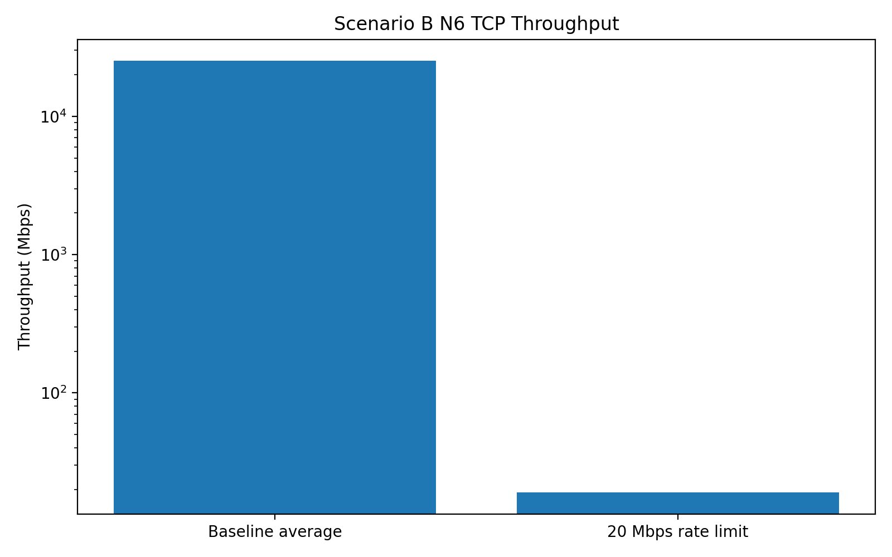
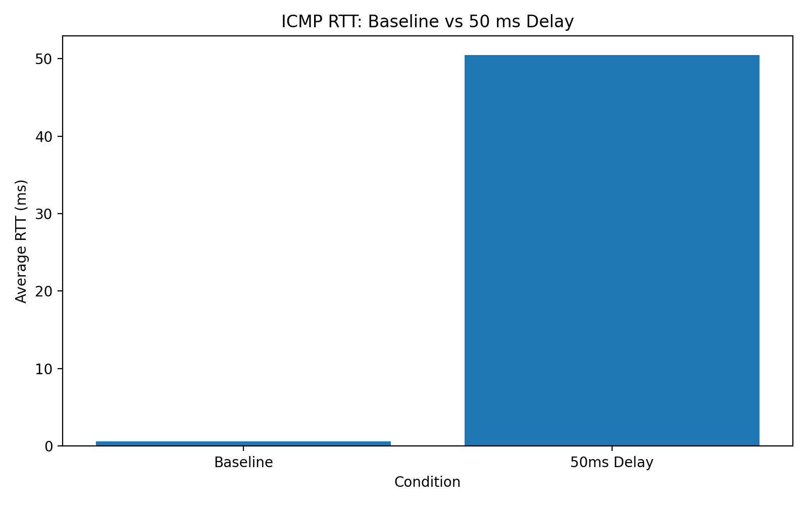
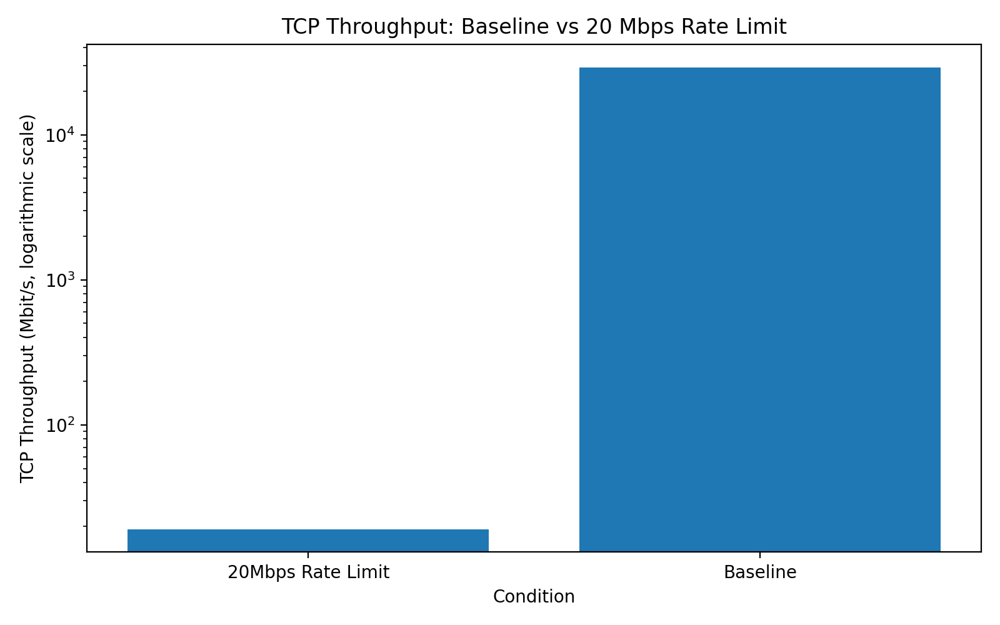

# Project 1: Network Deployment, Measurement, and Observability

## 1. Introduction

This project evaluates network deployment, verification, traffic observation, performance measurement, controlled degradation, and failure diagnosis in two scenarios.

Scenario A implements a hybrid network using Linux network namespaces and a Docker-based application server.

Scenario B models a 5G Standalone (SA) environment using Open5GS and UERANSIM, with an N6 data network containing Nginx and an iperf3 performance server.

The experimental workflow follows the project methodology:

**Deploy → Verify → Observe → Measure → Diagnose → Explain**

---

# 2. Scenario A — Hybrid Network

## 2.1 Architecture

Scenario A consists of:

**UE/Client → Access Network → Core/Gateway → Data Network → Application Server**

Linux namespaces were used for the UE, Access, and Core functions. Virtual Ethernet (veth) pairs provided connectivity between namespaces, while a Docker bridge provided access to the application/data network.

### IP Addressing

| Segment | Device | Address |
|---|---|---|
| UE–Access | UE | 10.10.1.2/24 |
| UE–Access | Access | 10.10.1.1/24 |
| Access–Core | Access | 10.10.2.1/24 |
| Access–Core | Core | 10.10.2.2/24 |
| Core–Data | Core | 10.10.3.1/24 |
| Core–Data | Docker gateway | 10.10.3.2/24 |
| Application | Nginx | 10.10.3.10/24 |

The application server was deployed using Nginx.

## 2.2 Deployment and Verification

The Scenario A network namespaces, virtual Ethernet interfaces, IP addressing, routing, Docker network, and Nginx application server were deployed.

End-to-end communication from the UE through the Access and Core network toward the Nginx application server was successfully verified.

ICMP connectivity and HTTP communication were tested.

## 2.3 Traffic Observation

Packet captures were collected for:

- ICMP
- HTTP
- UDP

The captures provide evidence of endpoints, protocols, ports, and packet behavior.

Important files include:

- `scenario-a/packet-captures/icmp.pcap`
- `scenario-a/packet-captures/http.pcap`
- `scenario-a/packet-captures/udp.pcap`

## 2.4 Baseline and Degraded Measurements

| Measurement | Result |
|---|---:|
| Baseline ICMP average RTT | 0.630 ms |
| ICMP RTT with +50 ms delay | 50.433 ms |
| Configured packet loss | 1% |
| Measured packet loss | 2% |
| Baseline TCP throughput | 29.2 Gbit/s |
| TCP throughput with 20 Mbps limit | 19.1 Mbit/s |
| Baseline UDP throughput | 10.0 Mbit/s |
| UDP jitter | 0.134 ms |
| UDP packet loss | 0% |
| HTTP response time | 9.616 ms |

The measurements demonstrate the effects of controlled delay, loss, and rate impairments.

Increasing delay increased the measured RTT. Packet-loss impairment resulted in measurable packet loss. The TCP rate limitation reduced throughput to approximately the configured target.

---

# 3. Scenario B — 5G Standalone Network

## 3.1 Architecture

Scenario B follows the 5G SA architecture:

**UE → gNB → N3/GTP-U → UPF → N6 → Data Network → Application/Performance Service**

The control and session path is:

**gNB → N2/NGAP/SCTP → AMF → SMF → N4/PFCP → UPF**

### Interface Mapping

| Interface | Connection | Protocol |
|---|---|---|
| UE–gNB | Simulated radio | UERANSIM |
| N2 | gNB–AMF | SCTP/NGAP |
| N3 | gNB–UPF | UDP/GTP-U |
| N4 | SMF–UPF | UDP/PFCP |
| N6 | UPF–Data Network | IP |

## 3.2 Environment

The Scenario B environment was implemented using Docker, Open5GS, UERANSIM, and MongoDB.

The Open5GS core included the main network functions such as AMF, SMF, UPF, NRF, SCP, AUSF, UDR, UDM, PCF, NSSF, BSF, and MongoDB.

UERANSIM provided the simulated gNB and UE.

## 3.3 Open5GS and gNB Deployment

The Open5GS core services were deployed and started.

The UERANSIM gNB was deployed and established an SCTP connection to the AMF.

The gNB logs provided evidence of:

- SCTP connection establishment
- NG Setup Request
- NG Setup Response
- Successful NG Setup procedure

This provides evidence for the N2 control-plane connection.

## 3.4 UE Registration and Failure Diagnosis

During the initial Scenario B deployment, UE registration encountered authentication and connectivity problems. The diagnostic logs included NAS timer expiry and SBI connectivity errors involving an endpoint at `172.22.0.35:7777`.

These events were treated as deployment troubleshooting evidence rather than the final state of the system.

The subscriber configuration and user-plane connectivity were subsequently corrected. The final UE logs showed:

- Authentication Request
- Security Mode Command
- Registration Accept
- Registration Complete
- `MM-REGISTERED/NORMAL-SERVICE`
- PDU Session Establishment Request
- PDU Session Establishment Accept
- Successful PDU session establishment
- `uesimtun0` with UE address `192.168.100.2`

The final state therefore provided a working UE-to-data-network user plane.

The earlier diagnostic logs are retained as failure-investigation evidence.

## 3.5 Packet Observation

Packet capture points were prepared for the required 5G interfaces.

### N2 — NGAP/SCTP

An N2 capture was configured for SCTP port 38412.

The gNB logs provided evidence of SCTP connection establishment, NG Setup Request, NG Setup Response, and successful NG Setup.

### N3 — GTP-U

An N3 capture was configured for UDP port 2152.

The final capture successfully collected GTP-U traffic.

Capture result:

- 1,355 packets captured
- 1,371 packets received by filter
- 0 packets dropped

TShark decoded GTP traffic carrying the UE-to-iperf3 performance traffic.

The observed outer path was:

`172.22.0.23 → 172.22.0.8`

using UDP port `2152`.

The inner traffic included:

`192.168.100.2 → 10.20.6.21`

This demonstrates the GTP-U encapsulation between the gNB and UPF.

### N4 — PFCP

An N4 capture was configured for UDP port 8805.

No PFCP packets were collected during the final packet-capture window. The final quantitative measurements therefore use the verified UE user-plane traffic and N3/GTP-U evidence rather than claiming final N4 packet-level evidence.

### N6 — Data Network

The N6 interface connects the UPF to the `10.20.6.0/24` data network.

The UPF used N6 address `10.20.6.2`.

The application endpoints were:

- Nginx: `10.20.6.20:80`
- iperf3: `10.20.6.21:5201`

UE-to-Nginx and UE-to-iperf3 traffic were successfully verified through the 5G user plane.

---

# 4. Scenario B N6 Data Network

A dedicated N6 Docker bridge network was created:

**10.20.6.0/24**

### N6 Addressing

| Component | Address |
|---|---|
| N6 gateway | 10.20.6.1 |
| UPF N6 address | 10.20.6.2 |
| Nginx | 10.20.6.20 |
| iperf3 | 10.20.6.21 |

The UPF was connected to the N6 network.

Nginx was deployed at `10.20.6.20`.

An HTTP request returned:

**HTTP/1.1 200 OK**

The iperf3 server was deployed at:

**10.20.6.21:5201**

and successful TCP connectivity was verified.

---

# 5. Scenario B Performance Measurements

## 5.1 Baseline
Three complete UE user-plane TCP iperf3 baseline measurements were performed using the UE network namespace.

| Run | Sender Throughput | Receiver Throughput | Retransmissions |
|---|---:|---:|---:|
| Baseline 1 | 264 Mbit/s | 264 Mbit/s | 368 |
| Baseline 2 | 310 Mbit/s | 309 Mbit/s | 395 |
| Baseline 3 | 317 Mbit/s | 316 Mbit/s | 380 |
| Average | 297.0 Mbit/s | 296.3 Mbit/s | 381 |

The average receiver throughput was:

**296.3 Mbit/s**

The measurement used the complete user-plane path:

**UE → gNB → N3/GTP-U → UPF → N6 → iperf3**

The UE-side source address was `192.168.100.2` and the iperf3 server was `10.20.6.21:5201`.


## 5.2 Controlled 20 Mbps Rate Limitation

A controlled 20 Mbit/s traffic rate limitation was applied to the UPF N6 interface `eth1` using Linux traffic control.

Configuration:

```text
tc qdisc add dev eth1 root tbf rate 20mbit burst 32kbit latency 400ms
```

Three 10-second TCP repetitions were performed through the complete UE user-plane path.

| Run | Sender | Receiver | Retransmissions |
|---|---:|---:|---:|
| 1 | 21.3 Mbit/s | 19.0 Mbit/s | 36 |
| 2 | 22.2 Mbit/s | 19.0 Mbit/s | 37 |
| 3 | 22.1 Mbit/s | 19.0 Mbit/s | 37 |
| Average | 21.87 Mbit/s | 19.0 Mbit/s | 36.67 |

The baseline receiver throughput was **296.3 Mbit/s**.

The controlled condition reduced receiver throughput to **19.0 Mbit/s**, corresponding to an approximately **93.6% reduction** relative to the baseline.

The rate limiter was removed after the experiment and the interface returned to its normal condition.

---

# 6. Python Analysis

The Scenario B measurements were stored in:

`scenario-b/measurements/performance_results.csv`

Python using pandas and Matplotlib was used to calculate:

- baseline average throughput
- degraded throughput
- throughput reduction

The analysis generated:

`scenario-b/analysis/throughput_comparison.png`

The graph uses a logarithmic throughput axis so that the baseline and degraded measurements can both be visualized clearly.

---

# 7. Monitoring

Prometheus/Grafana services were not active in the final Scenario B deployment state.

Therefore, Prometheus/Grafana dashboards were not used for the final quantitative measurements.

This is documented as a project limitation.

---

# 8. Comparison and Discussion

Scenario A provided a complete namespace-based network path with successful end-to-end application connectivity. It allowed direct measurement of ICMP, TCP, UDP, and HTTP behavior together with controlled delay, packet-loss, and rate-limit experiments.

Scenario B provided a software-based 5G SA architecture. Open5GS and UERANSIM were deployed, the gNB successfully established N2 connectivity with the AMF, UE registration and PDU session establishment were completed, and the N6 Data Network was created and measured.

The final Scenario B performance measurements used the complete user-plane path:

**UE → gNB → N3/GTP-U → UPF → N6 → Data Network**

The final dataset includes:

- ICMP RTT and packet loss
- TCP throughput and retransmissions
- UDP offered/received bitrate, jitter, and loss
- HTTP response timing
- Controlled 20 Mbit/s rate limitation
- N3/GTP-U packet-level evidence

The project demonstrates the importance of separating:

- control-plane evidence
- user-plane evidence
- application-level evidence
- performance measurements
- failure evidence

Container status alone is not sufficient to prove successful 5G user-plane operation; therefore, UE-to-application traffic and N3/GTP-U packet evidence were used for final verification.

---

# 9. Failure Diagnosis

The Scenario B deployment required troubleshooting before the final successful measurement state.

The initial diagnostic evidence followed this sequence:

**UE registration attempt**

↓

**RRC connection established**

↓

**CM-CONNECTED**

↓

**Initial Registration**

↓

**NAS timer expiry**

↓

**MM-DEREGISTERED**

At the core-network side, AMF logs showed SBI connectivity problems toward `172.22.0.35:7777`, including `No route to host`.

After the subscriber/session configuration and required user-plane connectivity were corrected, the final UE logs showed successful authentication, registration, and PDU session establishment.

The final state was verified by:

- UE registration
- PDU session establishment
- UE-to-Nginx connectivity
- UE-to-iperf3 TCP connectivity
- UE-to-iperf3 UDP connectivity
- N3/GTP-U packet evidence

The earlier failure logs are retained as evidence of the troubleshooting process.

---

# 10. Limitations

1. The final quantitative Scenario B measurements were completed after correcting the initial registration and user-plane connectivity problems.
2. N4/PFCP traffic was not collected during the final packet-capture window.
3. Prometheus/Grafana was not the source of the final quantitative measurements.
4. Additional suggested experiments such as +50 ms delay, 1% packet loss, and N3-versus-N6 impairment comparison were not included as completed results unless corresponding datasets are present in the repository.
5. The final controlled degradation experiment used a 20 Mbit/s rate limit on the UPF N6 interface.

These limitations are considered when interpreting the results.

---

# 11. Conclusion

The project implemented and evaluated two network scenarios.

Scenario A demonstrated a hybrid namespace/Docker network with successful end-to-end application connectivity, packet observation, baseline measurements, and controlled delay, packet-loss, and rate impairments.

Scenario B deployed Open5GS and UERANSIM, established gNB-to-AMF N2 connectivity, completed UE registration and PDU session establishment, created the N6 Data Network, deployed Nginx and iperf3 services, and performed quantitative measurements through the complete UE user-plane path.

The Scenario B troubleshooting process identified initial registration and connectivity problems, which were subsequently corrected. The final state was verified through UE-to-application traffic and N3/GTP-U packet evidence.

The final Scenario B dataset provides quantitative evidence for ICMP RTT, TCP throughput and retransmissions, UDP throughput/jitter/loss, HTTP response timing, controlled 20 Mbit/s degradation, and N3/GTP-U encapsulation.

Overall, the project demonstrates the workflow of network deployment, verification, packet observation, quantitative measurement, controlled degradation, troubleshooting, and evidence-based analysis.

---

# 12. Project Evidence


## Scenario A

Important Scenario A evidence includes:

- topology and namespace configuration
- interface and routing information
- Docker network and Nginx deployment
- ICMP packet capture
- HTTP packet capture
- UDP packet capture
- baseline measurements
- controlled delay, loss, and rate experiments
- Python analysis and graphs

## Scenario B

Important Scenario B evidence includes:

- Open5GS deployment screenshots
- UERANSIM gNB and UE deployment screenshots
- N2/NGAP evidence
- N3/GTP-U capture
- N4/PFCP capture
- N6 capture
- UE and AMF failure logs
- N6 network configuration
- Nginx connectivity test
- iperf3 connectivity and baseline measurements
- controlled 20 Mbps measurement
- CSV dataset
- Python analysis script
- throughput comparison graph

All implementation materials and supporting evidence should be included in the GitHub repository.

---

# 13. References and Tools

The project used the course assignment requirements as the primary methodology and used the following software/tools during implementation and analysis:

- Docker and Docker Compose
- Linux network namespaces and veth
- Open5GS
- UERANSIM
- MongoDB
- Nginx
- iperf3
- tcpdump
- Wireshark/TShark where applicable
- Python
- pandas
- Matplotlib
- Prometheus/Grafana where applicable
"""

## 13. Figures

### Figure 1 — Scenario B N6 TCP Throughput

The following figure compares the average baseline N6 TCP throughput with the controlled 20 Mbps rate-limited condition.



The logarithmic scale allows both the high baseline throughput and the substantially lower degraded throughput to be visualized on the same graph.

### Figure 2 — Scenario A and Scenario B Evidence

The complete deployment, verification, packet-observation, measurement, and failure-diagnosis screenshots are provided in:

- `scenario-a/screenshots/`
- `scenario-b/screenshots/`

These folders contain the supporting evidence for the experimental procedures and results described in this report.

## 14. Scenario A Analysis Figures

### Figure 3 — Scenario A ICMP RTT

The Scenario A Python analysis compares the baseline ICMP RTT with the controlled +50 ms delay condition.



### Figure 4 — Scenario A TCP Throughput

The Scenario A analysis compares the baseline TCP throughput with the controlled 20 Mbps rate-limited condition.



The complete Scenario A supporting screenshot evidence is available in `scenario-a/screenshots/`.
